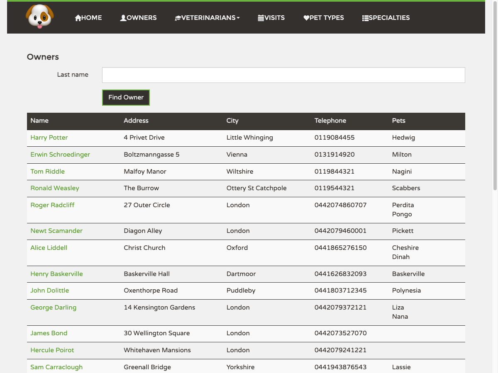

## Today

## Why

Issue #25 asks for an Owners list that can be sorted by column and browsed in pages of 5, 10
or 20. Today the page loads **every** owner at once, with all their pets and visits, and shows
them in one long table. With ~100.000 owners expected within a year (Bizu, Sep 2026) that page
would become unusable and would put the server under real strain on every visit.

This proposal adopts the decisions recorded in `Mici.md` on branch `kc26`.

## What Changes

**For the clinic staff**
- The Owners page shows one page of owners at a time, with a pager offering 5, 10 or 20 rows
  (10 by default) and the total count.
- The **Name** and **City** columns can be sorted, ascending or descending, by clicking the
  header. Address and Telephone stay unsortable: real addresses start with house numbers and
  phone numbers are inconsistent, so sorting them would look random.
- Owner names are shown as **"Rentea, Victor"** (last name first) everywhere in the app, and
  the Name column sorts the same way. Names with diacritics (e.g. "Śliwiński") sort next to
  their plain letter, not at the end of the alphabet.
- The last-name search keeps working exactly as today; a new search always starts from the
  first page and keeps the chosen sort and page size.
- The page address in the browser records the current page, size, sort and search, so a
  refresh keeps your place and a link can be shared.
- If the list fails to load, an error message appears instead of a misleading "No owners".
- The Owners page shows each owner's pet names but no longer carries visit details in the
  list; visits remain on the owner's detail page.

**For the system**
- The server returns owners one page at a time, sorted in the database, and never the whole
  table. Requests asking for anything other than 5, 10 or 20 rows are refused.
- Sorting stays fast at 100.000 owners: the database gets the indexes it needs, and a
  one-off load test at that scale is documented as proof.

**Process**
- The decisions are posted on issue #25, including that Name sorts last-name-first, which
  differs from what an outside contributor described as already implemented.

## Capabilities

### New Capabilities
- `owners-list`: how the clinic lists owners — paged and sorted, the sortable columns and
  their ordering, allowed page sizes, behaviour on errors and edge cases, the remembered page
  address, and the "Last, First" name rendering.

### Modified Capabilities
None — there are no specs yet; the existing last-name search behaviour is carried into
`owners-list` unchanged.

## Impact

- **Owners page** (the list) changes visibly; the owner detail, add and edit pages only
  change how the name is displayed.
- **Pets and visits pages** show the owner's name in the new "Last, First" form.
- **Anything reading the owner list from the server** must be updated, because the response
  shape changes. Known consumers are the Owners page and the automated end-to-end tests; the
  chatbot and its tooling are checked during implementation.
- **Not changed**: the owner counter used elsewhere in the app, the owner detail data, the
  phone-number validation mismatch found while digging (separate ticket).

Technical details — parameters, data shapes, indexes, files — are in `design.md`.
